百宝箱ai构建的h5智能体支持跳转三方登录页完成登录，以及跳转三方支付页完成支付并回调到智能体页面，**保持跳转前的状态**

## 效果展示
[lQbPJx4b0LiNXNMAALBXsxSG_9061QpiWfHE94YA.mp4](https://yuque.antfin.com/attachments/lark/0/2026/mp4/57256414/1787829367540-dd959c48-902c-414a-859a-22c3a813d44e.mp4)


## 流程图

```mermaid
sequenceDiagram
    participant Home as H5 首页
    participant Server as Server / Agent
    participant Card as H5 支付订单卡片
    participant Bridge as 桥阶层
    participant Mini as 小程序页面

    Home->>Server: 发送 query「支付订单」
    Server->>Server: 识别支付意图
    Server->>Server: 调用 payOrder tool
    Server-->>Card: 下发 pay-order 卡片数据

    Card->>Card: 校验登录态<br/> url query token / sessionStorage token

    alt 未登录
        Card->>Bridge: 请求打开登录页
        Bridge->>Mini: 调用 my.navigateTo<br/> 注册event监听事件
        Mini->>Mini: 用户点击「完成登录」
        Mini-->>Bridge: eventChannel.emit 返回 token
        Bridge-->>Card: webViewContext.postMessage 回传结果
				Bridge->>Card: 校验上一页是智能体<br/> my.navigateBack 返回H5
        Card->>Card: 保存 token
        Card->>Card: 重新校验登录态
    end

    Card->>Card: 已登录，展示「去支付」

    Card->>Bridge: 请求打开支付页
    Bridge->>Mini: 调用 my.navigateTo<br/> 注册event监听事件
    Mini->>Mini: 用户点击「完成支付」
    Mini-->>Bridge: eventChannel.emit 返回 tradeNo
    Bridge-->>Card: webViewContext.postMessage 回传结果
		Bridge->>Card: 校验上一页是智能体<br/> my.navigateBack 返回H5

    Card->>Server: POST /api/mock-payment-orders/:orderId/paid
    Server-->>Card: 订单状态写为 PAID

    loop 轮询支付状态
        Card->>Server: GET /api/mock-payment-orders/:orderId
        Server-->>Card: status = PAID
    end

    Card->>Card: 切换展示「已支付」
```



### 简化链路
```javascript
H5 卡片
  → my.postMessage 发起桥请求

小程序桥阶层
  → my.navigateTo 打开登录页/支付页

登录页/支付页
  → getOpenerEventChannel().emit(...) 把 token/tradeNo 传回桥阶层

小程序桥阶层
  → webViewContext.postMessage(receipt) 把结果传回 H5

H5
  → my.onMessage 接收 receipt
  → 根据 requestId resolve 对应 Promise
```


## 登录代码示例
### h5智能体侧


### 小程序登录/支付页面侧


## 登录态
登录态“校验”时支持两种来源：

```plain
URL query token
或
sessionStorage 里的 token
```

其中 URL query token 是“外部进入 H5 时已经带了 token”的场景，登录页回跳时，因为执行`my.navigateBack()`后，<font style="color:#DF2A3F;">webview h5的页面状态也是不变的</font>，所以不能用URL query。

三方登录页完成后返回的 token 可以通过 `postMessage` 到 H5，然后 H5 存到 `sessionStorage`，卡片重新校验时读 `sessionStorage`。


## 涉及JSAPI
+ EventChannel.emit：[https://opendocs.alipay.com/mini/api/eventchannel.emit?pathHash=bc2e2277](https://opendocs.alipay.com/mini/api/eventchannel.emit?pathHash=bc2e2277)
+ my.postMessage：[https://opendocs.alipay.com/mini/component/web-view](https://opendocs.alipay.com/mini/component/web-view)
