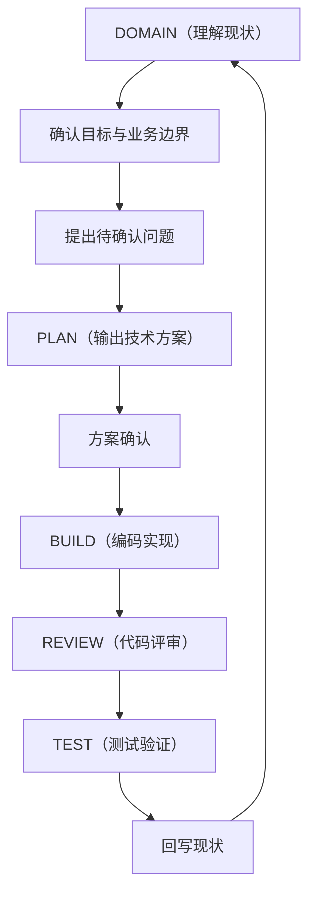

## 1. Skill 简介
alipay-digital-payment-skill 是一个面向 AI 编程助手（CodeBuddy、Claude Code、Codex、Qoder、DeepSeek Harness 等）的 Skill，帮助支付宝商家后端系统（CRM/会员/营销/停车等）接入支付宝数字支付和商家能力。

**支持的产品：**

> 支付宝商家产品学习视频：[https://alipay-video.app.weavefox.cn/#/](https://alipay-video.app.weavefox.cn/#/)
>

| 产品 | 核心能力 |
| --- | --- |
| 商家会员卡 | 会员卡模板创建、开卡组件集成、资产回传（积分/等级/余额）、消息通知 |
| 支付即积分 | 圈店、交易消息订阅、积分累计、积分补录、退款积分回滚 |
| 会员停车助手 | 车场配置、停车消息同步、停车费用查询 SPI、会员停车权益、订单同步 |
| 商家券 | 券活动创建/修改/停止、券码同步、券核销/退券、券消息通知、领券组件 |


**Skill 工作流程：**



## 2. 安装 Skill
### 2.1 下载安装
在 AI 编程助手中输入以下内容，将 Skill 安装到目标商家项目中：

```plain
帮我下载下面 Skill，安装到当前项目里使用
https://env-00jy61udznyh.normal.cloudstatic.cn/alipay-digital-payment-skill.zip
```

## 3. 通用使用流程
每个产品的接入都遵循以下步骤：

| 步骤 | 操作 | 说明 |
| --- | --- | --- |
| 1 | 安装 Skill 到目标项目 | 在商家项目（如积分系统、CRM 系统、停车系统）中安装 Skill |
| 2 | 现状分析与技术方案生成 | 告诉 Skill 目标产品和项目路径，Skill 自动分析代码仓库现状，产出架构文档和业务领域现状文档，生成技术系分方案 |
| 3 | 技术方案调整 | 用自然语言提出修改意见，Skill 调整方案 |
| 4 | 确认方案并编码测试 | 确认方案没问题后，Skill 完成代码编写和测试验证 |
| 5 | 答疑咨询 | 随时向 Skill 咨询接入准备、接口字段、错误码等问题 |


---

## 4. 商家会员卡接入
### 4.1 产品简介
[商家会员卡产品说明](https://opendocs.alipay.com/open/03sx7r?pathHash=73c5584b&ref=api)

商家会员卡是支付宝提供的数字化会员运营产品。商家开卡后会员卡落用户支付宝卡包，支持将会员等级、积分、余额信息回传，及配置会员权益在卡包卡面上展示。

**核心流程：** 模板创建 → 开卡插件集成 → 开卡接口对接 → 资产回传

### 4.2 接入步骤
> 接入商家会员卡需要后端会员系统接入，另外支付宝小程序前端需要接入支付宝会员开卡组件
>

#### 步骤 1：安装 Skill 到会员系统项目
在 AI 编程助手中打开商家项目（如 CRM 系统、会员系统），输入：

```plain
帮我下载下面 Skill，安装到当前项目里使用
https://env-00jy61udznyh.normal.cloudstatic.cn/alipay-digital-payment-skill.zip
```

#### 步骤 2：现状分析与技术方案生成
```plain
/alipay-digital-payment-skill 当前项目需要接入支付宝商家会员卡产品，帮我分析一下业务系统现状并产出技术系分方案
```

Skill 会自动完成以下工作：

+ 分析商家代码仓库的技术架构、模块划分、技术栈、数据库/缓存/MQ、外部依赖
+ 产出 `docs/alipay-integration/系统整体技术架构.md`
+ 按照商家会员卡接入指南，逐项理解会员资产归属（六维度）、运营模式、CRM 接口能力、积分/等级变动入口、会员等级体系、会员卡与会员码、跨系统一致性、外部渠道接入现状
+ 产出 `docs/alipay-integration/商家会员卡业务领域现状.md`
+ 生成技术系分方案，覆盖：卡模板创建、开卡 SPI 对接、资产回传链路、消息通知处理

#### 步骤 3：技术方案调整
用自然语言提出修改意见，例如：

```plain
/alipay-digital-payment-skill 技术方案中卡模板只需要一个通用模板，不需要按等级创建多个模板；积分同步改为实时调用而非消息异步
```

#### 步骤 4：确认方案并编码测试
```plain
/alipay-digital-payment-skill 技术方案没问题，帮我完成代码编写和测试验证
```

#### 步骤 5：安装 Skill 到支付宝小程序前端会员项目中
在 AI 编程助手中打开小程序前端会员统，输入：

```plain
帮我下载下面 Skill，安装到当前项目里使用
https://env-00jy61udznyh.normal.cloudstatic.cn/alipay-digital-payment-skill.zip
```

#### 步骤 6：接入支付宝会员开卡组件
```plain
/alipay-digital-payment-skill 当前小程序项目需要接入支付宝商家会员卡开发卡组件，帮我完成接入
```

#### 步骤 7：答疑咨询
```plain
/alipay-digital-payment-skill 接入商家会员卡需要做什么准备？
```

```plain
/alipay-digital-payment-skill 会员卡模板创建接口的必填参数有哪些？
```

### 4.3 关键确认事项
Skill 在现状分析阶段会重点确认以下内容：

+ **商圈运营模式**：单体商圈还是集团商圈；统一收银还是独立收银
+ **资产归属（六维度）**：会员主档、会员卡、积分、等级、余额、权益分别归属集团还是门店
+ **积分和等级变动入口**：所有触发积分/等级变化的入口及同步策略
+ **会员等级体系**：等级枚举、等级权益差异、等级与卡模板映射
+ **CRM 接口能力**：会员查询、积分查询/变更、等级查询等 API 的入参和返回值
+ **外部渠道接入现状**：是否已对接微信会员卡、抖音会员等平台

### 4.4 涉及的支付宝接口
| 接口 | 类型 | 用途 |
| --- | --- | --- |
| `alipay.marketing.card.template.create` | API | 创建会员卡模板 |
| `spi.alipay.user.opencard.get` | SPI | 会员卡开卡，获取会员信息 |
| `alipay.marketing.card.update` | API | 更新会员卡（积分/等级/余额回传） |
| `alipay.user.opencard.result.notify` | 通知 | 开卡结果通知 |
| `alipay.marketing.card.query` | API | 查询会员卡信息 |
| `alipay.marketing.card.delete` | API | 删除会员卡 |
| `alipay.marketing.card.message.notify` | API | 会员卡消息通知 |


---

## 5. 支付即积分接入
### 5.1 产品简介
[支付即积分产品说明](https://opendocs.alipay.com/pre-solution/0jd3pn)

综合体支付即积分解决方案借助支付宝线下支付、小程序、会员卡、圈店等能力，帮助商圈实现快速发展会员。当会员在场内使用支付宝支付时，商圈可实时获知交易信息并给用户累积相应积分。

**核心流程：** 业务准备与开通 → 圈店 → 会员卡对接 → 交易消息订阅 → 积分累计 → 积分补录

### 5.2 接入步骤
> 接入支付即积分需要后端积分系统接入，支付宝小程序前端需要接入积分补录入口
>

#### 步骤 1：安装 Skill 到积分系统项目
在 AI 编程助手中打开积分系统或 CRM 系统，输入：

```plain
帮我下载下面 Skill，安装到当前项目里使用
https://env-00jy61udznyh.normal.cloudstatic.cn/alipay-digital-payment-skill.zip
```

#### 步骤 2：现状分析与技术方案生成
```plain
/alipay-digital-payment-skill 当前项目需要接入支付宝支付即积分产品，帮我分析一下业务系统现状并产出技术系分方案
```

Skill 会自动完成以下工作：

+ 分析积分系统的技术架构、积分规则、变动入口、账户结构和外部依赖
+ 产出系统整体技术架构文档
+ 按照支付即积分接入指南，逐项理解：积分归属与跨商场消费、积分变动入口完整性、积分规则与约束、退款积分回滚、积分兑换模式、积分变动通知方式、跨系统一致性
+ 产出业务领域现状文档
+ 生成技术系分方案，覆盖：圈店方案、交易消息订阅（交易成功/退款）、积分累计逻辑、积分补录、会员卡积分同步

#### 步骤 3：技术方案调整
```plain
/alipay-digital-payment-skill 积分规则需要支持版本管理，退款时关联原始规则版本回滚；部分退款按比例回滚
```

#### 步骤 4：确认方案并编码测试
```plain
/alipay-digital-payment-skill 技术方案没问题，帮我完成代码编写和测试验证
```

#### 步骤 5：安装 Skill 到支付宝小程序前端项目中
在 AI 编程助手中打开小程序前端项目，输入：

```plain
帮我下载下面 Skill，安装到当前项目里使用
https://env-00jy61udznyh.normal.cloudstatic.cn/alipay-digital-payment-skill.zip
```

#### 步骤 6：接入支付宝支付即积分的积分补录入口
```plain
/alipay-digital-payment-skill 当前小程序项目需要接入支付宝支付即积分的积分补录，帮我完成接入
```

#### 步骤 7：答疑咨询
```plain
/alipay-digital-payment-skill 接入支付即积分接口后，为什么会员开卡时没有展示积分授权信息
```

### 5.3 关键确认事项
+ **积分归属与跨商场消费**：积分在集团、门店还是商户层面累计；能否跨商场消费
+ **积分变动入口**：场内消费、兑换、补录、过期、手工调整、活动赠送、签到、退款扣减——每个入口变动后是否触发会员卡积分同步
+ **积分规则**：是否有版本管理；退款时如何关联原始规则版本；积分有效期；单笔/日/余额上限
+ **退款积分回滚**：退款金额不等于应扣积分；部分退款按比例还是按规则回滚
+ **积分兑换模式**：有自有积分商城（接口兑换）还是无积分商城（H5 嵌入）
+ **跨系统一致性**：商户是否有独立会员系统；同步方式（实时/异步）；补偿机制

### 5.4 涉及的支付宝接口
| 接口 | 类型 | 用途 |
| --- | --- | --- |
| `alipay.business.mall.trade.success` | 通知 | 商圈交易成功信息订阅 |
| `alipay.business.mall.trade.refunded` | 通知 | 商圈交易退款信息订阅 |
| `alipay.business.mall.tradeapply.notify` | 通知 | 商圈积分补录申请交易通知 |
| `alipay.commerce.operation.mallhome.physicalshop.query` | API | 商圈物理门店批量查询 |


---

## 6. 会员停车助手接入
### 6.1 产品简介
[会员停车助手产品接入说明](https://opendocs.alipay.com/pre-solution/0j4xw1)

综合体会员停车 3.0 方案将停车场、支付宝停车助手、商场会员系统和停车缴费小程序串联起来，形成业务闭环：车辆入场 → 会员身份识别 → 消费积分 → 查费缴费 → 离场同步。

**核心流程：** 车场配置 → 入场消息同步 → 会员停车权益 SPI → 费用查询 SPI → 支付缴费 → 订单同步 → 离场消息

### 6.2 接入步骤
> 接入会员停车助手仅需要后端停车系统接入即可，不涉及支付宝小程序前端改造
>

#### 步骤 1：安装 Skill 到停车系统项目
在 AI 编程助手中打开停车系统或含停车模块的综合项目，输入：

```plain
帮我下载下面 Skill，安装到当前项目里使用
https://env-00jy61udznyh.normal.cloudstatic.cn/alipay-digital-payment-skill.zip
```

#### 步骤 2：现状分析与技术方案生成
```plain
/alipay-digital-payment-skill 当前项目需要接入支付宝会员停车助手产品，帮我分析一下业务系统现状并产出技术系分方案
```

Skill 会自动完成以下工作：

+ 分析停车系统的技术架构、车场供应商对接、计费规则、停车业务 API、外部依赖
+ 同时理解会员系统、积分系统和支付与订单系统现状（停车与缴费一体，需跨领域理解）
+ 产出系统整体技术架构文档
+ 逐项确认：车场供应商与设备、停车全链路业务流程（入场→缴费→离场→费用查询→订单同步）、车场信息与计费规则、停车业务对外 API、外部系统依赖、停车缴费支付渠道（直连/间联）、小程序与页面归属、会员停车权益、外部渠道接入现状
+ 产出业务领域现状文档
+ 生成技术系分方案

**重要前置判断**：Skill 会先确认三项已有基础——(1) 商家会员卡是否已接入、(2) 小程序支付缴费是否已具备、(3) 车场供应商是否已与支付宝完成停车助手接口接入。三项均已具备时，新增范围仅为综合体会员信息咨询 SPI。

#### 步骤 3：技术方案调整
```plain
/alipay-digital-payment-skill 停车费用查询 SPI 由车场供应商实现，商圈系统只负责会员信息咨询 SPI；支付渠道是直连支付宝
```

#### 步骤 4：确认方案并编码测试
```plain
/alipay-digital-payment-skill 技术方案没问题，帮我完成代码编写和测试验证
```

#### 步骤 5：答疑咨询
```plain
/alipay-digital-payment-skill 接入会员停车助手需要做什么准备？
```

### 6.3 关键确认事项
+ **车场供应商与设备**：对接哪家车场供应商；车场设备型号；车场数量
+ **停车全链路**：入场检测方式 → 缴费支付链路（小程序/岗亭）→ 离场检测 → 费用查询来源 → 订单同步链路
+ **计费规则**：计费周期、跳费、日封顶、免费时长的配置位置和计算方式
+ **停车缴费支付渠道**：直连支付宝还是间联支付宝；是否参与缴费立减活动
+ **会员停车权益**：权益类型（免费时长/减免金额/免费次数/积分抵扣）、权益与等级关联、叠加规则、跨车场通用性
+ **前置能力**：商家会员卡、小程序支付缴费、车场供应商支付宝接入——三项的完成状态决定接入工作量

## 7. 商家券接入
### 7.1 产品简介
[商家券产品说明](https://opendocs.alipay.com/pre-solution/0h8hf0)

商家券 2.0 是支付宝提供的营销券产品，支持商家在支付宝平台分发投放日常经营券，帮助触达更多消费者，从线上领券引流到线下消费。支持满减券、折扣券、特价券、兑换券等多种券类型。

**核心流程：** 门店准备（圈店）→ 活动创建 → 券码同步 → 发券 → 核销 → 退券 → 消息通知

### 7.2 接入步骤
> 接入商家券需要后端营销券系统接入，支付宝小程序前端需要接入领取组件
>

#### 步骤 1：安装 Skill 到券系统项目
在 AI 编程助手中打开营销券系统或含券模块的综合项目，输入：

```plain
帮我下载下面 Skill，安装到当前项目里使用
https://env-00jy61udznyh.normal.cloudstatic.cn/alipay-digital-payment-skill.zip
```

#### 步骤 2：现状分析与技术方案生成
```plain
/alipay-digital-payment-skill 当前项目需要接入支付宝商家券产品，帮我分析一下业务系统现状并产出技术系分方案
```

Skill 会自动完成以下工作：

+ 分析营销券系统的技术架构、券码模式、券类型、核销退款流程、活动管理、推广渠道
+ 产出系统整体技术架构文档
+ 逐项确认：券码生成方式与格式、券类型与适用场景、券核销与退款流程（券状态流转、核销方式、退券能力）、活动管理（创建/修改/停止/预算追加）、推广渠道与领券方式、统收/非统收模式对券系统的影响、外部渠道接入现状
+ 产出业务领域现状文档
+ 生成技术系分方案

#### 步骤 3：技术方案调整
```plain
/alipay-digital-payment-skill 券码采用提前批量生成模式；核销时需校验门店范围；支持统收和非统收两种模式
```

#### 步骤 4：确认方案并编码测试
```plain
/alipay-digital-payment-skill 技术方案没问题，帮我完成代码编写和测试验证
```

#### 步骤 5：安装 Skill 到支付宝小程序前端项目中
在 AI 编程助手中打开小程序前端项目，输入：

```plain
帮我下载下面 Skill，安装到当前项目里使用
https://env-00jy61udznyh.normal.cloudstatic.cn/alipay-digital-payment-skill.zip
```

#### 步骤 6：接入支付宝商家券领券组件
```plain
/alipay-digital-payment-skill 当前小程序项目需要接入支付宝商家券领券组件，帮我完成接入
```

#### 步骤 7：答疑咨询
```plain
/alipay-digital-payment-skill 接入商家券需要做什么准备？
```

### 7.3 关键确认事项
+ **券码模式**：提前批量生成（导码）还是发券时实时生成；券码格式、唯一性、存储和库存管理
+ **券类型**：支持的券类型（满减/折扣/特价/兑换）；券面信息来源；核销有效期
+ **券核销与退款**：券状态枚举和流转规则；核销方式（扫码/自动/人工）；统收/非统收场景核销与交易关系；退券能力
+ **活动管理**：活动创建审批流程；预算管理（发券数量上限、追加方式）；活动修改和停止
+ **推广渠道**：公域投放、商家小程序领券、支付后推荐；券码与卡包展示
+ **统收/非统收影响**：统收场景券可用范围关联蚂蚁门店 ID；非统收场景需圈店关联物理门店 ID

## 8. 常见问题
### Q: Skill 安装后如何更新文档？
```bash
/alipay-digital-payment-skill  更新下最新文档
```

SKill内部已做 12 小时自动更新。

### Q: 技术方案生成后如何修改？
直接用自然语言告诉 Skill 需要调整的内容，例如"积分同步改为消息异步"或"卡模板按门店创建多个"。Skill 会根据反馈调整方案。

### Q: 方案确认后 Skill 会自动编码吗？
不会。方案确认后需要明确指示"技术方案没问题，帮我完成代码编写和测试验证"后，Skill 才开始编码。

### Q: 交付后还有哪些待办事项？
代码交付后，Skill 会逐项列出现有代码仓库之外的待办事项，包括：

+ 支付宝开放平台权限开通和产品签约
+ 商家平台（B站）配置（如会员卡模板创建、券活动配置、SPI 服务地址配置）
+ 前端改动（如小程序页面、JSAPI 调用、开卡组件集成）
+ 其他系统或团队配合事项

每项待办会注明操作平台、具体动作、是否阻塞上线、以及不完成时的影响。
